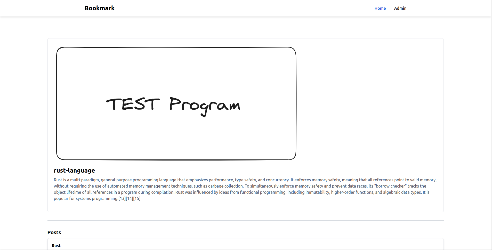
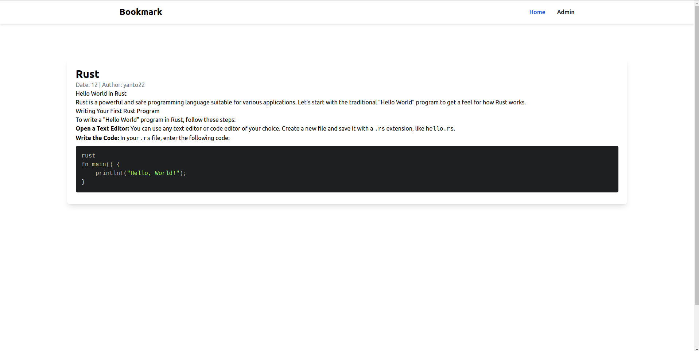

# Bookmark Tauri Go-Chi

## Overview

This project is a bookmark application built with Tauri and Go-Chi. It allows users to save and manage bookmarks using a desktop application.

## Features

- Add, Update, Delete Category
- Add, Update, Delete Post
- Add, Delete Posts File Markdown

## Installation

- Install Rust
- Install Tauri
- Install Go-Chi
- Run `tauri dev`

## Usage

### Use Localhost

```sh
backend:
go run cmd/app/main.go


frontend:
yarn dev
```

### Use Docker

```sh
backend:
docker-compose up --build -d


frontend:
yarn build
```

### Demo

### Category Id pages



### Post Id pages


